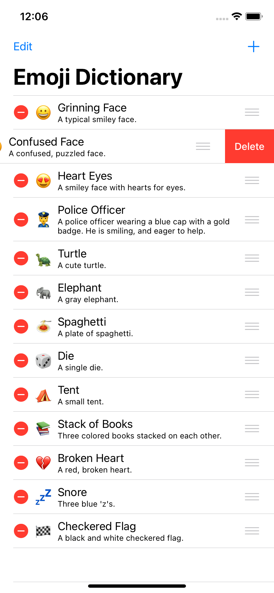

# Emoji Dictionary

A simple app where you pick an emoji. (project from Apple's course on iTunes, "App Development with Swift")

## Features:

* Dynamic table view
* Static table view
* CRUD Emoji Objects
* Customized table view cells

## Screenshots

